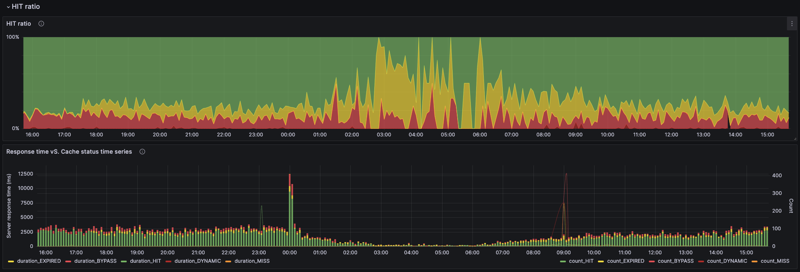

# SSR Cache Workers

## Spartacus SSR

This is the way SAP Commerce manages rendering.

<details>
<summary>Click this to collapse/fold.</summary>

```
title SAP Commerce SSR

Browser->+Cloudflare: GET /es/men
Cloudflare->+js-app:  GET /es/men
js-app->+js-app-ssr:  render /es/men
js-app-ssr->Cloudflare: GET https://hostname.com/assets/translations/xxx.json
js-app-ssr->Cloudflare: ...
js-app-ssr->Cloudflare: GET https://pq-api.hostname.com/api/pages
js-app-ssr->Cloudflare: ...
alt SSR OK
    js-app-ssr-->>-js-app:  rendered HTML
    js-app-->>-Cloudflare:  rendered HTML
    Cloudflare->Cloudflare: cache for next calls in a given colo
    Cloudflare-->>-Browser: MISS
else CSR
    activate js-app-ssr
    js-app-ssr-->>-js-app:  index.html
    activate js-app
    js-app-->>-Cloudflare:  index.html
    activate Cloudflare
    Cloudflare-->>-Browser: BYPASS
end
```
</details>


## Expected behavior
### HIT Scenario

Two cache levels:
- *L1* is Cloudflare colo specific cache area
- *L2* shared among different colos. Based on `R2`

<p>
<details>
<summary>Click this to collapse/fold.</summary>

```
title SAP Commerce SSR Strategy HIT

participant Browser
participant Cloudflare
participant R2
participant SAP Commerce Cloud v2


Browser->+Cloudflare: GET resource
alt colo HIT
    Cloudflare->Cloudflare: is cached
    Cloudflare-->>-Browser: SSR response
else R2
    Cloudflare->+Cloudflare: is NOT cached
    Cloudflare->+R2: GET resource
    alt R2 HIT
        R2->R2: is cached
        R2-->>-Cloudflare: SSR response
        Cloudflare-->>-Browser: SSR response
    else node.js HIT
        R2->+R2: is NOT cached
        R2-->>+Cloudflare: {empty}
        deactivate R2
        Cloudflare->+SAP Commerce Cloud v2:  GET resource
        SAP Commerce Cloud v2->SAP Commerce Cloud v2: is cached
        SAP Commerce Cloud v2-->>-Cloudflare: SSR response
        Cloudflare-->>-Browser: SSR response
    end
end
```
</details>


### MISS Scenario

In case of `MISS` different caches are warmed up.

<details>
<summary>Click this to collapse/fold.</summary>

```
title SAP Commerce SSR Strategy NO HIT

participant Browser
participant Cloudflare
participant R2
participant SAP Commerce Cloud v2


Browser->+Cloudflare: GET resource
Cloudflare->Cloudflare: is NOT cached
Cloudflare->+R2: GET resource
R2->R2: is NOT cached
R2-->>-Cloudflare: {empty}

alt Real Customer BYPASS
    note over Cloudflare, SAP Commerce Cloud v2
        Real customers does NOT wait for SSR processing [timeout = 0]
    end note
    Cloudflare->+SAP Commerce Cloud v2:  GET resource [timeout =  0]
    SAP Commerce Cloud v2->SAP Commerce Cloud v2: is NOT cached
    SAP Commerce Cloud v2-->>Cloudflare: /index.html (CSR response)
    Cloudflare-->>Browser: /index.html (CSR response)
    SAP Commerce Cloud v2-->>-SAP Commerce Cloud v2: PUT in node.js cache
    
    loop while CSR response
        state over Cloudflare: lazy warmup
        
        Cloudflare->+Cloudflare: sleep nth millis
        Cloudflare->>+SAP Commerce Cloud v2: GET resource [timeout ~ 10]
        SAP Commerce Cloud v2->SAP Commerce Cloud v2: is cached
        SAP Commerce Cloud v2-->>-Cloudflare: SSR response
        Cloudflare-->>R2: PUT in shared cache
        Cloudflare-->>-Cloudflare: PUT in colo cache
        deactivate Cloudflare
    end
else Known Bot MISS
    note over Cloudflare, SAP Commerce Cloud v2
        Known Bots has a long timeout to enforce SSR as much as possible
    end note

    Cloudflare->+SAP Commerce Cloud v2: GET resource [timeout ~ 10]
    activate Cloudflare
    SAP Commerce Cloud v2->SAP Commerce Cloud v2: is NOT cached
    SAP Commerce Cloud v2-->>SAP Commerce Cloud v2: PUT in node.js cache
    SAP Commerce Cloud v2 -->>-Cloudflare:  /index.html (SSR response)
    Cloudflare-->>Browser: SSR response
    Cloudflare-->>R2: PUT in shared cache
    Cloudflare-->>-Cloudflare: PUT in colo cache
end
```
</details>


# Nomenclature

* `L1`: colo cache
* `L2`: R2
* `L3`: origin

# ssrRenderer


## Testing

### Known Bot

```shell
curl -v  'https://www.ohgar.com/es/c/test-ssr-cache-3/CT0003037' \
  -H 'user-agent: Googlebot' \
  -o /tmp/output.html 2>&1 | grep "<"
```

### Customer

```shell
curl -v  'https://www.ohgar.com/es/c/test-ssr-cache-3/CT0003037' \
  -o /tmp/output.html 2>&1 | grep "<"
```

## Monitor

https://developers.cloudflare.com/analytics/analytics-engine/get-started/
https://developers.cloudflare.com/analytics/graphql-api/

[Wrangler tail](https://github.com/cloudflare/wrangler-legacy/issues/1368#issuecomment-640116634)

```shell
wrangler tail --format json --env wow-p1 | jq -r \
       '# loop through all logs while still having the full object accessible
    .logs[] as $o |
        # loop through messages in each log
    $o.message[] as $m |
        # set variables for clarity (you can put these in the format string instead)
    .event.request.headers."cf-connecting-ip" as $ip |
    .event.request.headers."cf-ray" as $ray |
    ($o.timestamp / 1000 | todate) as $datetime |
        # Format the output
    "[\($datetime)][\($o.level)][\($ip)][\($ray)] \($m)"'
```

TODO SQL postman 

## Development environment setup

```shell
lerna bootstrap
cd packages/sitemap
npm install
cd packages/ssr-cache
npm install
```


### Client Request

* Simulating a bot
    ```shell
    curl -v  'https://www.ohgar.com/es/c/test-ssr-cache-3/CT0003037' \
      -H 'user-agent: Googlebot' \
      -o /tmp/output.html 2>&1 | grep "<"
    ```
* Normal customer
    ```shell
    curl -v  'https://www.ohgar.com/es/c/test-ssr-cache-3/CT0003037' \
      -o /tmp/output.html 2>&1 | grep "<"
    ```

## Monitoring

### Server Logs

See [Wrangler tail](https://github.com/cloudflare/wrangler-legacy/issues/1368#issuecomment-640116634)

```shell
wrangler tail --format json --env p1 | jq -r \
       '# loop through all logs while still having the full object accessible
    .logs[] as $o |
        # loop through messages in each log
    $o.message[] as $m |
        # set variables for clarity (you can put these in the format string instead)
    .event.request.headers."cf-connecting-ip" as $ip |
    ($o.timestamp / 1000 | todate) as $datetime |
        # Format the output
    "[\($datetime)][\($o.level)][\($ip)] \($m)"'
```

* Sample server log for `HIT`:
    ```
    [2023-05-15T11:24:22Z][log][90.164.157.9] [L0][0] Request '/es/c/test-ssr-cache-3/CT0003037?0=1223542131312399122123' to be handled by L1
    [2023-05-15T11:24:22Z][log][90.164.157.9] [L1][0] Request '/es/c/test-ssr-cache-3/CT0003037?0=1223542131312399122123' fetched in 16 ms
    ```
* Sample server log for `MISS`:
    ```
    [2023-05-15T11:24:56Z][log][90.164.157.9] [L0][0] Request '/es/c/test-ssr-cache-3/CT0003037?0=12235421313123991221232' to be handled by L1
    [2023-05-15T11:24:56Z][log][90.164.157.9] [L1][0] Request '/es/c/test-ssr-cache-3/CT0003037?0=12235421313123991221232' to be handled by L3
    [2023-05-15T11:24:56Z][log][90.164.157.9] [L3][0] Request '/es/c/test-ssr-cache-3/CT0003037?0=12235421313123991221232' fetched in 108 ms
    [2023-05-15T11:24:56Z][log][90.164.157.9] [L1][0] Request '/es/c/test-ssr-cache-3/CT0003037?0=12235421313123991221232' is not cacheable. Rendering mode is 'CSR'
    [2023-05-15T11:24:56Z][log][90.164.157.9] [L0][0] Request '/es/c/test-ssr-cache-3/CT0003037?0=12235421313123991221232' is not cacheable. Rendering mode is 'CSR'
    [2023-05-15T11:24:56Z][log][90.164.157.9] [L0][0] Request '/es/c/test-ssr-cache-3/CT0003037?0=12235421313123991221232' is CSR, retrying in background
    [2023-05-15T11:24:56Z][log][90.164.157.9] [L0][0] Request '/es/c/test-ssr-cache-3/CT0003037?0=12235421313123991221232' sleeping for 2000 ms
    [2023-05-15T11:24:58Z][log][90.164.157.9] [L0][1] Request '/es/c/test-ssr-cache-3/CT0003037?0=12235421313123991221232' to be handled by L1
    [2023-05-15T11:24:58Z][log][90.164.157.9] [L1][1] Request '/es/c/test-ssr-cache-3/CT0003037?0=12235421313123991221232' to be handled by L3
    [2023-05-15T11:24:59Z][log][90.164.157.9] [L3][1] Request '/es/c/test-ssr-cache-3/CT0003037?0=12235421313123991221232' fetched in 667 ms
    [2023-05-15T11:24:59Z][log][90.164.157.9] [L1][1] Request '/es/c/test-ssr-cache-3/CT0003037?0=12235421313123991221232' is not cacheable. Rendering mode is 'NOT'
    [2023-05-15T11:24:59Z][log][90.164.157.9] [L0][1] Request '/es/c/test-ssr-cache-3/CT0003037?0=12235421313123991221232' is not cacheable. Rendering mode is 'NOT'
    ```

### Analytics

See[Get started with Workers Analytics Engine](https://developers.cloudflare.com/analytics/analytics-engine/get-started/)

There is a [postman collection](https://app.getpostman.com/join-team?invite_code=ce1ecca1b27270f0aa576081c399f5a8&target_code=395e344406fac33f2e686640139ce667) available for checking analytics data:

- [Collection](./collections/Ohgar.postman_collection.json)
- [Environment](./collections/p1.postman_environment.json)

As an instance following query obtains cache stats:

```sql
SELECT
    intDiv(toUInt32(timestamp), 300) * 300 AS t, 
    index1 as handler,    
    blob4 AS cf_cache_status,
    SUM(_sample_interval * double2) / SUM(_sample_interval) AS avg_duration
FROM ssr_cache_p1
WHERE timestamp > NOW() - INTERVAL '1' DAY
GROUP BY t, handler, cf_cache_status
ORDER BY t, handler, cf_cache_status
FORMAT JSONEachRow
```

```json lines
{"t":"1684144500","handler":"L0","cf_cache_status":"BYPASS","avg_duration":103}
{"t":"1684144500","handler":"L0","cf_cache_status":"DYNAMIC","avg_duration":555}
{"t":"1684144500","handler":"L0","cf_cache_status":"HIT","avg_duration":14}
{"t":"1684144500","handler":"L1","cf_cache_status":"BYPASS","avg_duration":103}
{"t":"1684144500","handler":"L1","cf_cache_status":"DYNAMIC","avg_duration":555}
{"t":"1684144500","handler":"L1","cf_cache_status":"HIT","avg_duration":14}
{"t":"1684144500","handler":"L2","cf_cache_status":"BYPASS","avg_duration":103}
{"t":"1684144500","handler":"L2","cf_cache_status":"DYNAMIC","avg_duration":555}
{"t":"1684144500","handler":"L3","cf_cache_status":"BYPASS","avg_duration":103}
{"t":"1684144500","handler":"L3","cf_cache_status":"DYNAMIC","avg_duration":555}
{"t":"1684145400","handler":"L0","cf_cache_status":"BYPASS","avg_duration":101.5}
{"t":"1684145400","handler":"L0","cf_cache_status":"DYNAMIC","avg_duration":685}
{"t":"1684145400","handler":"L0","cf_cache_status":"HIT","avg_duration":13.25}
{"t":"1684145400","handler":"L0","cf_cache_status":"MISS","avg_duration":115.75}
{"t":"1684145400","handler":"L1","cf_cache_status":"BYPASS","avg_duration":101.5}
{"t":"1684145400","handler":"L1","cf_cache_status":"DYNAMIC","avg_duration":685}
{"t":"1684145400","handler":"L1","cf_cache_status":"HIT","avg_duration":13.25}
{"t":"1684145400","handler":"L1","cf_cache_status":"MISS","avg_duration":115.75}
{"t":"1684145400","handler":"L2","cf_cache_status":"BYPASS","avg_duration":101.5}
{"t":"1684145400","handler":"L2","cf_cache_status":"DYNAMIC","avg_duration":685}
{"t":"1684145400","handler":"L2","cf_cache_status":"MISS","avg_duration":115.75}
{"t":"1684145400","handler":"L3","cf_cache_status":"BYPASS","avg_duration":101.5}
{"t":"1684145400","handler":"L3","cf_cache_status":"DYNAMIC","avg_duration":685}
{"t":"1684145400","handler":"L3","cf_cache_status":"MISS","avg_duration":115.75}
```

#### [Grafana Dashboard](https://julioarguello.grafana.net/goto/JEKyK7C4g?orgId=1)

> An up-to-date export of the Grafana dashboard is available at [repository](https://github.com/julioarguello/ssr-cache-worker/blob/main/monitoring/grafana/WoW%20SSR-1689082912235.json).


##### Filters

Grafana dashboard can be filtered out by:
- **Rendering mode**: [`SSR`, `CSR`] 
- **Cache status**: [`HIT`, `EXPIRED`, `MISS`, `BYPASS`, `DYNAMIC`]
- **Source**: [`L1`, `L2`, `L3`]
- **Country**: [`ES`, `FR`...]
- **User agent**: [`SSRWarmUpCrawler/1.0 (Gitlab; Seidor)`]
- **Colo**: [`MAD`, `BCN`...]
- **Worker Attempt**: [`1`, `2`, `3`, `4`...]
- **Http Status**: [`200`, `404`...]


##### Summary

There are top levels visualizations for:
- HIT ratio
- Source
- Cloudflare colos
- Worker attempt


##### HIT Ratio

HIT ratio is split in two graphs:
1. Timeline with the percentage of requests per cache status.
2. Timeline with number of requests per cache status and average response time.



##### Handler Ratio

Handler ratio is split in two graphs:
1. Timeline with the percentage of requests per source handler.
2. Timeline with number of requests per source handler and average response time.


##### Table

Detailed table with raw information at analytics engine.


## Deployment

```shell
wrangler2 login

wrangler2 dev
# wrangler2 publish --env d1
# wrangler2 publish --env s1
# wrangler2 publish --env p1
```
